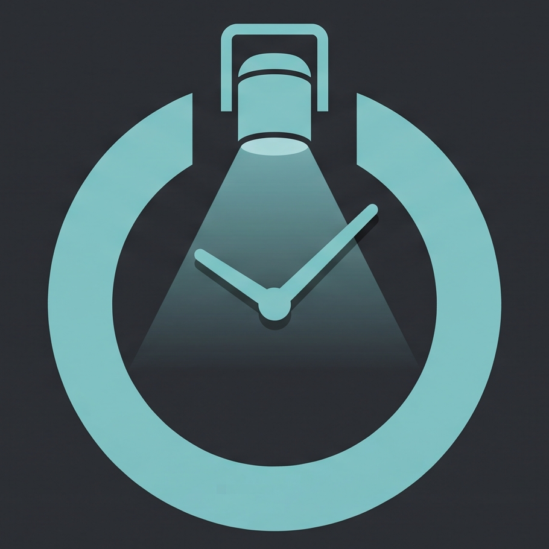
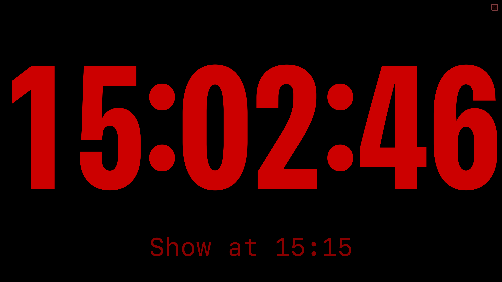
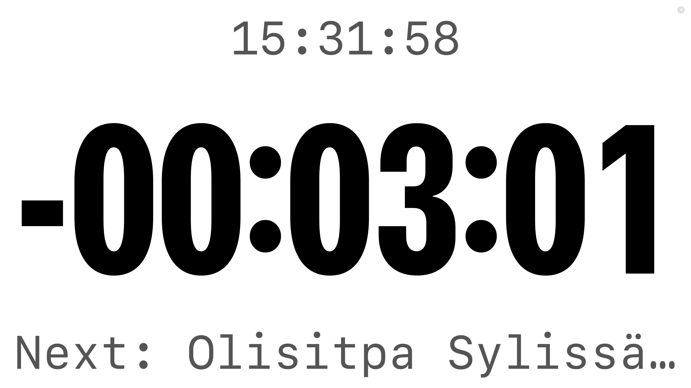
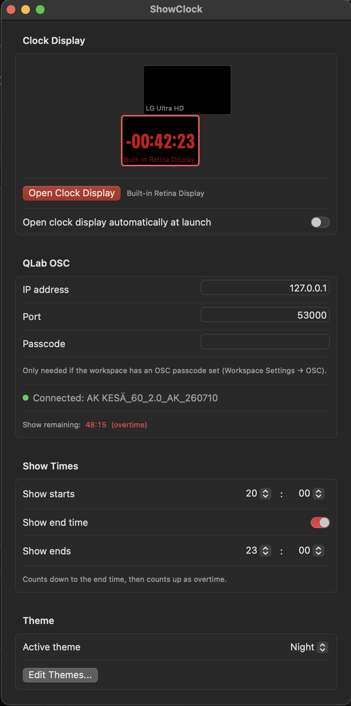
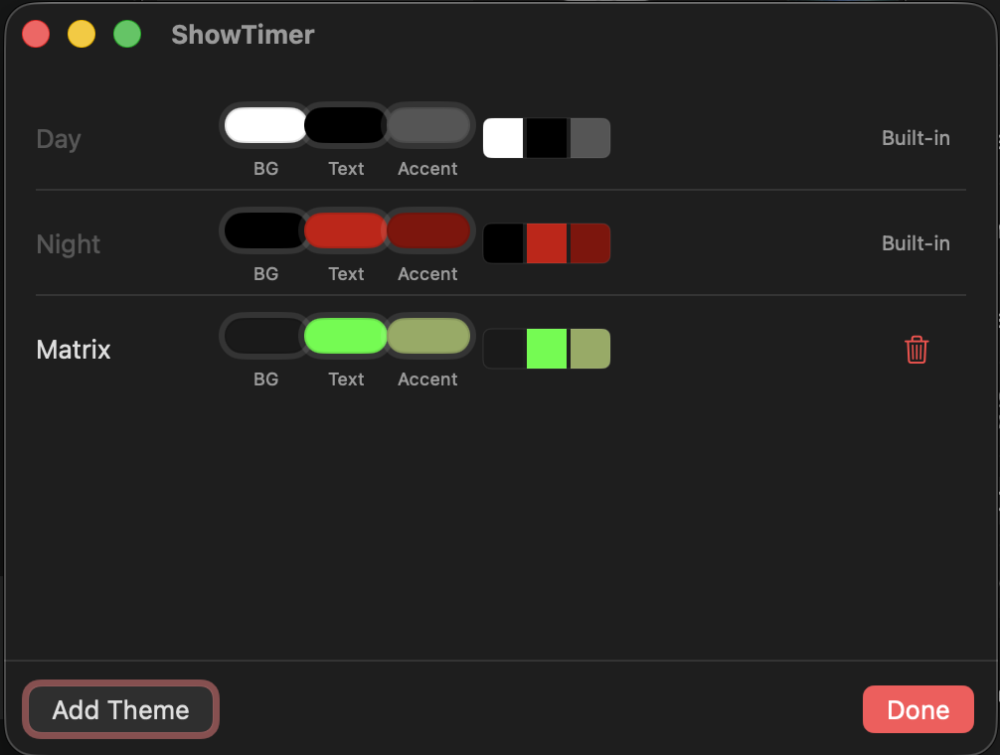

<p align="center">
  
</p>

<h1 align="center">ShowClock</h1>

<p align="center">A macOS show clock for live events, with QLab OSC integration.</p>

ShowClock puts a full-screen clock on an external display for stage managers, operators, and crew to see at a glance: a plain clock before the show starts, then a countdown to show end, then overtime if things run long — all synced with what QLab is actually doing, not just a fixed timer.

<table>
  <tr>
    <td><br><sub>Pre-show</sub></td>
    <td><br><sub>Countdown, with next cue</sub></td>
  </tr>
  <tr>
    <td><br><sub>Settings</sub></td>
    <td><br><sub>Theme editor</sub></td>
  </tr>
</table>

## Features

- **Full-screen clock display**, pinned to whichever connected display you choose, with a live preview in Settings so you can see exactly what it'll show before opening it.
- **QLab integration** over OSC: shows the next cue's name, and estimates the whole rest-of-show remaining time (current cue plus every armed cue still ahead of it) — not just what's playing right now.
- **Optional show-end time**: countdown to it, then automatic overtime once it passes, reverting to a plain clock once QLab says the show is actually over. Skip it entirely and ShowClock just runs as a continuous clock.
- **Multiple displays**, with automatic re-detection if something connects or disconnects mid-show.
- **Day/Night themes**, plus a built-in editor for your own.
- **Update checking** against GitHub Releases, manual or automatic.
- A confirmation before quitting while the display is open, so Cmd+Q mid-show doesn't silently drop your QLab connection.

## Installing

Download the latest `ShowClock.dmg` from [Releases](https://github.com/sntr8/showclock/releases), open it, and drag ShowClock into Applications.

> [!IMPORTANT]
> This build isn't signed with a paid Apple Developer ID, so macOS Gatekeeper will say it's from an "unidentified developer" (or, on first launch, offer no option at all until you do this): **right-click (or Control-click) `ShowClock.app` → Open → Open** again in the confirmation dialog. You only need to do this once.

## Using it with QLab

1. In QLab, enable OSC: **Workspace Settings → OSC**, and set a passcode there if you want one.
2. In ShowClock's Settings, enter QLab's IP address (`127.0.0.1` if it's the same Mac) and port (`53000` by default), plus the passcode if you set one, then **Connect**.
3. Set your show's start time (and, optionally, an end time) under **Show Times**.
4. Pick a display and **Open Clock Display**.

## Building from source

Requires macOS 14+ and Swift 5.9+. No external dependencies.

```
swift build
swift run
```

To build a standalone `.app` (and a drag-to-Applications `.dmg`, which additionally needs `brew install create-dmg`):

```
./Packaging/build-app.sh 1.0.0
./Packaging/make-dmg.sh dist/ShowClock.app dist/ShowClock.dmg
```

See [`docs/release-process.md`](docs/release-process.md) for how tagged releases get built and published, and [`CLAUDE.md`](CLAUDE.md) for architecture notes.

## Support

ShowClock is free. If it's useful to you and you'd like to support future updates, you can [buy me a Coca-Cola on Ko-fi](https://ko-fi.com/sntr8).

## License

[PolyForm Noncommercial 1.0.0](LICENSE) — free for personal, hobby, and noncommercial use. Contact me if you'd like to use it commercially.
